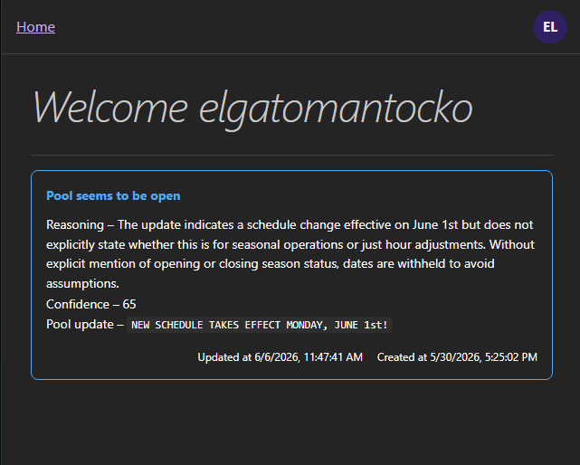
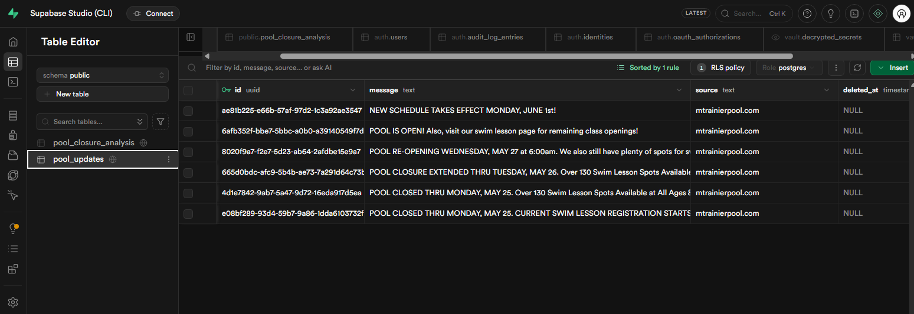
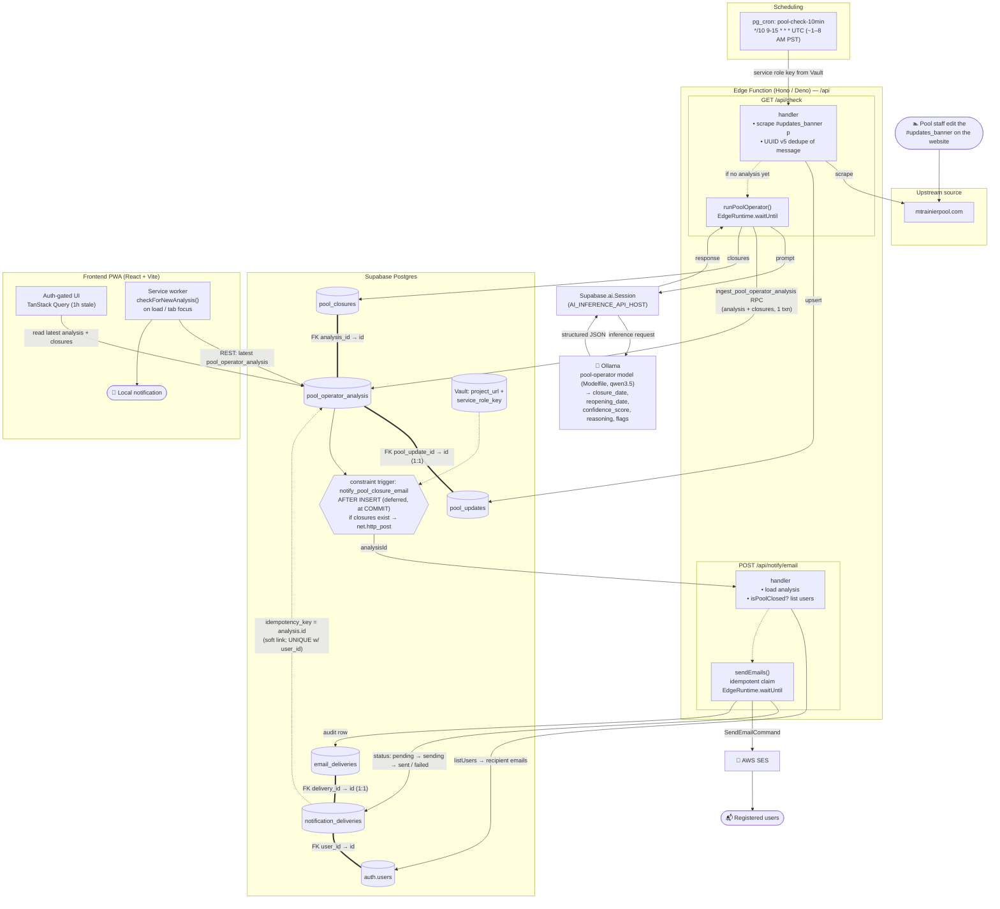

# Mt. Rainier Pool Checker

> **Fair warning:** this is completely over-engineered. The problem could be solved with a mailing list that mtrainierpool.com maintains. This project exists because I wanted an excuse to play with Supabase and Postgres.

An app that tracks whether the Mt. Rainier pool is open. It scrapes the pool's website, stores closure announcements in Supabase, and runs them through an AI model to extract structured open/closed status with dates and confidence scores. When the pool closes, it emails registered users and the installed PWA shows a closure notification.

## a simple ui



## supabase dashboard



## Stack

| Layer    | Tech                                                             |
| -------- | ---------------------------------------------------------------- |
| Frontend | React 19 + Vite PWA, TanStack Router, TanStack Query, Mantine v9 |
| Backend  | Supabase Edge Function (Deno), Hono, zod-openapi                 |
| Database | Supabase Postgres                                                |
| Auth     | Supabase Auth — email/password + Discord OAuth                   |
| AI       | Supabase AI (`pool-operator` model)                              |
| Email    | AWS SES (closure notifications + Auth SMTP)                      |

## How it works

1. `GET /api/check` scrapes `mtrainierpool.com` and extracts the status banner text.
2. Each unique message is stored in `pool_updates` (deduplicated by UUID v5 of the message).
3. The `pool-operator` AI model analyzes the message and extracts one or more closures (`closure_date`, `reopening_date`, `confidence_score`, `reasoning`, `flags`) — ingested as a `pool_operator_analysis` row plus its `pool_closures` children in a single transaction.
4. A `pg_cron` job triggers `/api/check` every 10 minutes during the morning PST window automatically.
5. A Postgres trigger on `pool_operator_analysis` calls `POST /api/notify/email` (only when the analysis produced at least one closure), which emails registered users via AWS SES. Deliveries are tracked idempotently in `notification_deliveries` / `email_deliveries`.
6. The frontend displays the latest analysis to authenticated users. On load (and when the tab regains focus) the page asks its service worker to fetch the latest analysis and show a local notification if the pool is closed.

## Architecture & data flow



## Prerequisites

- [Deno](https://deno.land/) v2
- [Node.js](https://nodejs.org/) + [Yarn](https://yarnpkg.com/) v4
- [Supabase CLI](https://supabase.com/docs/guides/cli)

## Local development

### 1. Start Supabase

```sh
supabase start
```

This runs the full local Supabase stack (Postgres, Auth, Edge Runtime, Studio at `:54323`).

### 2. Set up environment variables

Create `frontend/.env.local`:

```
VITE_SUPABASE_URL=http://127.0.0.1:54321
VITE_SUPABASE_ANON_KEY=<anon key from supabase start output>
```

Create `.env` in the repo root (for the scripts CLI):

```
SUPABASE_URL=http://127.0.0.1:54321
SUPABASE_ANON_KEY=<anon key>
SUPABASE_SERVICE_ROLE_KEY=<service role key>
```

### 3. Start the frontend

```sh
yarn workspace frontend dev
# → http://localhost:3000
```

### 4. Serve the edge function

```sh
supabase functions serve
```

### 5. Trigger a pool check manually

```sh
yarn pool check
```

## Code generation

After changing the API routes or database schema, regenerate derived files:

```sh
# Regenerate TypeScript types from local Supabase schema
yarn gen:types

# Regenerate the scripts/client/ API client from the OpenAPI spec
yarn pool create-client
```

> `scripts/client/` and `frontend/src/routeTree.gen.ts` are generated — do not edit them by hand.

## Project structure

```
├── frontend/               # React PWA (Yarn workspace)
│   └── src/
│       ├── api/            # TanStack Query options + Supabase client
│       ├── components/     # UI components
│       └── routes/         # File-based routes (TanStack Router)
├── supabase/
│   ├── functions/api/      # Hono edge function (Deno)
│   └── migrations/         # Postgres migrations
└── scripts/
    ├── pool.ts             # CLI entrypoint
    └── client/             # Generated API client (do not edit)
```

## Self-hosting

The frontend is served via Docker using `vite preview`. The Supabase stack must already be running (`supabase start`) before starting the container — it creates the `supabase_network_swimming` Docker network that the frontend joins to proxy API requests.

### Prerequisites

- [Docker Desktop](https://www.docker.com/products/docker-desktop/)
- [Ollama](https://ollama.com/) — runs the `pool-operator` AI model used by the edge function

### Environment variables

Create a `.env` file at the repo root. These are read by `supabase start` via the `env(...)` references in `supabase/config.toml`:

| Variable                    | Required | Description                                                                     |
| --------------------------- | -------- | ------------------------------------------------------------------------------- |
| `AI_INFERENCE_API_HOST`     | Yes      | Ollama base URL, e.g. `http://host.docker.internal:11434`                       |
| `SITE_BASE_URL`             | Yes      | Public URL of the app, e.g. `https://your-domain.com`. Used for auth redirects. |
| `DISCORD_AUTH_SECRET`       | Yes      | Discord OAuth application secret                                                |
| `DISCORD_AUTH_REDIRECT_URI` | Yes      | Discord OAuth callback URL, e.g. `https://your-domain.com/auth/callback`        |
| `AWS_ACCESS_KEY_ID`         | Yes      | AWS SES access key (closure emails + Auth SMTP)                                 |
| `AWS_SECRET_ACCESS_KEY`     | Yes      | AWS SES secret key                                                              |
| `AWS_REGION`                | No       | SES region for the edge function; defaults to `us-west-2`                       |
| `SMTP_ADMIN_EMAIL`          | Yes      | Verified SES sender / From address                                              |
| `SMTP_HOST`                 | Yes      | SES SMTP host for Supabase Auth, e.g. `email-smtp.us-west-2.amazonaws.com`      |
| `OPENAI_API_KEY`            | No       | Enables AI features in Supabase Studio                                          |

### Steps

**1. Create the Ollama model**

The edge function calls a `pool-operator` model defined in `Modelfile` (based on `qwen3.5`):

```sh
ollama create pool-operator -f Modelfile
```

**2. Start Supabase**

```sh
supabase start
```

**3. Configure `frontend/.env`**

```sh
VITE_SUPABASE_URL=https://<your-domain>:<port>
VITE_SUPABASE_ANON_KEY=<your-anon-key>
```

These are baked into the build by Vite — update them before building the image.

**4. Place TLS certificates**

```
supabase/certs/privkey.pem
supabase/certs/fullchain.pem
```

If the certs are absent the preview server falls back to HTTP.

**5. Build and run**

```sh
docker compose up --build
```

The frontend is available on port `3000`. API calls (`/rest/v1`, `/auth/v1`, `/storage/v1`, `/functions/v1`) are proxied to Kong (`supabase_kong_swimming:8000`) over the shared Docker network.
